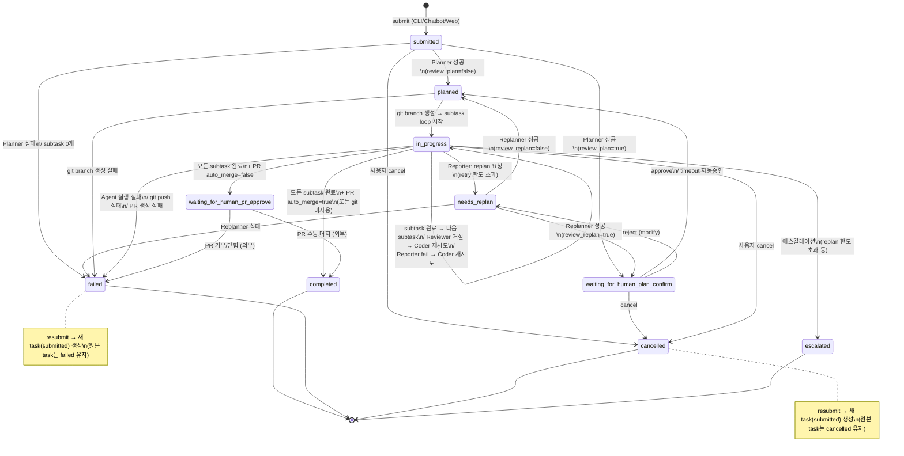

# Task Lifecycle — Finite State Machine

> 최종 업데이트: 2026-04-06
> Task JSON의 `status` 필드가 거치는 모든 상태와 전이를 표현한다.

## 상태 분류

| 분류 | 상태 | 설명 |
|------|------|------|
| **초기** | submitted | task 생성 직후, .ready sentinel 대기 |
| **계획** | planned | Planner 완료, 실행 대기 (또는 human review 전) |
| **대기** | waiting_for_human_plan_confirm | 사용자 승인/거부 대기 중 |
| **대기** | needs_replan | 사용자가 plan 거부, 재계획 필요 |
| **실행** | in_progress | subtask 실행 중 (Coder → Reviewer → 테스트 루프) |
| **리뷰** | waiting_for_human_pr_approve | PR 생성 완료, 수동 머지 대기 |
| **종료** | completed | 정상 완료 (auto_merge 또는 수동 머지 후) |
| **종료** | failed | 실행 실패 (planner/coder/git/PR 등) |
| **종료** | cancelled | 사용자 취소 |
| **종료** | escalated | 한도 초과 에스컬레이션 (수동 개입 필요) |

---

## FSM 다이어그램 (Mermaid)



---

## 전이 상세 (트리거 → 소스 코드 위치)

### submitted →
| 대상 | 트리거 | 위치 |
|------|--------|------|
| planned | Planner 성공 + review_plan=false | `workflow_controller.py` run_pipeline() |
| waiting_for_human_plan_confirm | Planner 성공 + review_plan=true | `workflow_controller.py` request_human_review() |
| failed | Planner 실행 실패 / subtask 0개 생성 | `workflow_controller.py` run_pipeline() |
| cancelled | 사용자 cancel 명령 | `core.py` cancel() |

### waiting_for_human_plan_confirm →
| 대상 | 트리거 | 위치 |
|------|--------|------|
| planned | approve 응답 / auto_approve timeout | `core.py` approve(), `workflow_controller.py` wait_for_human_response() |
| needs_replan | reject (modify) 응답 | `core.py` reject() |
| cancelled | cancel 응답 / 사용자 cancel 명령 | `workflow_controller.py` wait_for_human_response(), `core.py` cancel() |

### needs_replan →
| 대상 | 트리거 | 위치 |
|------|--------|------|
| waiting_for_human_plan_confirm | Replanner 성공 + review_replan=true | `workflow_controller.py` run_pipeline() |
| planned | Replanner 성공 + review_replan=false | `workflow_controller.py` run_pipeline() |
| failed | Replanner 실패 | `workflow_controller.py` run_pipeline() |

### planned →
| 대상 | 트리거 | 위치 |
|------|--------|------|
| in_progress | git branch 생성 성공 → subtask loop 시작 | `workflow_controller.py` run_pipeline() |
| failed | git branch 생성 실패 | `workflow_controller.py` run_pipeline() |

### in_progress →
| 대상 | 트리거 | 위치 |
|------|--------|------|
| in_progress | subtask 간 전환, Coder 재시도 (self-loop) | `workflow_controller.py` run_pipeline_from_subtasks() |
| needs_replan | Reporter: replan 요청 (retry 한도 초과) | `workflow_controller.py` run_pipeline_from_subtasks() |
| escalated | replan 한도 초과 에스컬레이션 | `workflow_controller.py` run_pipeline_from_subtasks() |
| completed | 모든 subtask 완료 + auto_merge=true (또는 git 미사용) | `workflow_controller.py` finalize_task() |
| waiting_for_human_pr_approve | 모든 subtask 완료 + auto_merge=false | `workflow_controller.py` finalize_task() |
| failed | Agent 실행 실패 / git push 실패 / PR 생성 실패 | `workflow_controller.py` 각 agent 실행 지점 |
| cancelled | cancel 명령 파일 감지 | `workflow_controller.py` check_cancel_command() |

### waiting_for_human_pr_approve →
| 대상 | 트리거 | 위치 |
|------|--------|------|
| completed | 사용자가 PR 수동 머지 | 외부 (GitHub) |
| failed | 사용자가 PR 거부/닫힘 | 외부 (GitHub) |

### 종료 상태 (completed, failed, cancelled, escalated)
- **더 이상 자동 전이 없음** (terminal state)
- failed/cancelled → `resubmit` 시 **새 task가 submitted로 생성** (원본 task 상태 불변)

---

## Pipeline Stage (in_progress 내부 세부 단계)

`in_progress` 상태일 때 `pipeline_stage` 필드로 세부 진행 단계를 추적:

```
planner → plan_review → git_branch → coder → reviewer → git_push → summarizer → pr_create → finalizing → done
```

| pipeline_stage | 설명 |
|----------------|------|
| planner | Planner agent 실행 중 |
| plan_review | Human review 대기 중 |
| git_branch | git branch 생성 중 |
| coder | Coder agent 실행 중 (pipeline_stage_detail: subtask ID) |
| reviewer | Reviewer agent 실행 중 |
| git_push | subtask 커밋 + push 중 |
| summarizer | Summarizer agent 실행 중 |
| pr_create | PR 생성 중 |
| finalizing | 최종 정리 중 |
| done | 파이프라인 완료 |

---

## 프로젝트 상태 (project_state.json)

프로젝트에는 **lifecycle** (관리 상태)과 **status** (운영 상태) 두 가지 상태가 있다.

### lifecycle (프로젝트 lifecycle)

| lifecycle | 의미 | task 제출 | 기본 목록 |
|-----------|------|:---------:|:---------:|
| `active` | 정상 운영 (기본값) | O | 표시 |
| `closed` | 종료 | X (차단) | `--all`로만 표시 |

- `close_project`: 모든 task가 종료 상태일 때만 가능
- `reopen_project`: closed → active 재전환
- 폴더 소실 시 syncer가 DB에서 자동 closed 처리

### status (운영 상태, active일 때의 세부 상태)

| 상태 | 설명 |
|------|------|
| idle | 실행 중인 task 없음 |
| running | WFC가 task 실행 중 |
| waiting_for_human_plan_confirm | human review 대기 |

---

## Task 큐 블로킹 상태

TM이 다음 task spawn을 차단하는 "미완료" 상태 집합:

```python
incomplete_statuses = {"in_progress", "planned", "running", "waiting_for_human_plan_confirm", "needs_replan"}
```

이 상태 중 하나라도 있으면 (wait_for_prev_task_done=true일 때) 다음 task를 spawn하지 않음.
